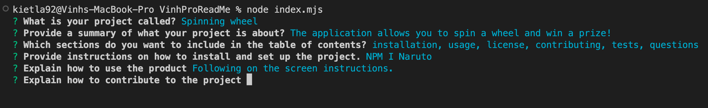

# Vinhs README Generator

## Description

This project creates a command-line application that accepts user inputs to create a README. 

## Getting started

A quick guide to help you get started with the project.

### Prerequisites

- Install Node.js version 19.6.1
- Install Inquirer version 6.5.1

### Installation
1. `git clone https://github.com/VinhKietLa/Vinhs-README-Generator.git`
2. Download [NodeJS v19.6.1](https://nodejs.org/en/download/releases/)
3. `npm i inquirer@v^6.5.1`

## Usage

To run the application open index.mjs in your terminal and run `node index.mjs` to start the application. 

You will see in your terminal questions and once all questions have been answered you will be provided with a message to let you know that the application is finished. 

A README.md will also be created based on the inputs to the questions asked.

## Tech stack

- NodeJS
- Inquirer JS
- FS node library
- Javascript (Switch statement and objects).

## Preview of application

## Contact

If you have any questions, please do not hesitate to contact me via email at kietla@live.co.uk :)