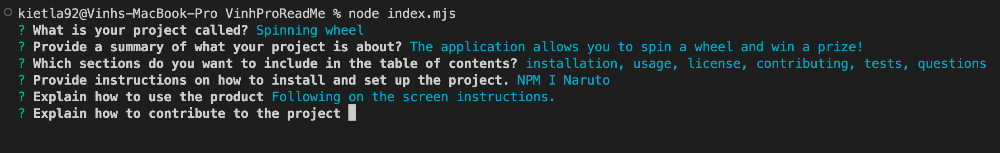

# Vinhs-Pro-README-Generator

## Description

This project creates a README with NodeJS, Inquirer and FS using the inputs from the user. 

## Installation

To install the application you will need to:

1. Clone the repository -> [Github respository](https://github.com/VinhKietLa/Vinhs-Pro-README-Generator)
2. Install NodeJS v19.6.1 -> [NodeJs](https://nodejs.org/en/download/)
3. Install Inquirier v19.6.0 -> [Inquirer](https://www.npmjs.com/package/inquirer)
4. Use the command 'node index.mjs' to start the application.

## Preview of application

### Technologies used

- NodeJS 
- Javascript
- Inquirer
- FS Library

